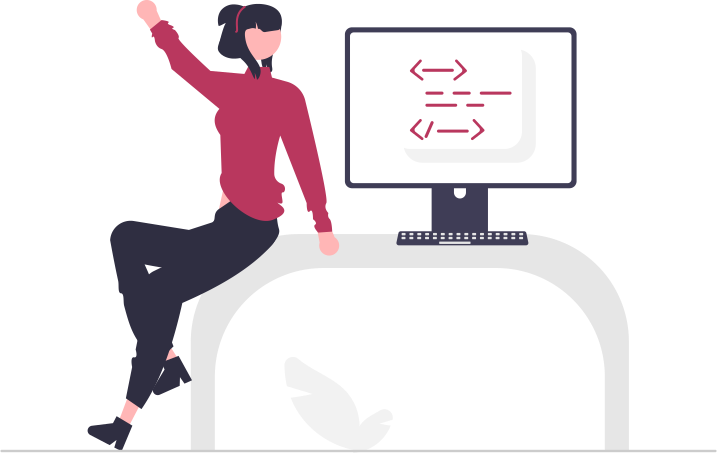

<h1 align="center">Portfolio - Daniela Rodríguez</h1>

<h2>Module 1 CSS & HTML Project: The front-end developer portfolio</h2>
This mobile-responsive portfolio project showcases the creative abilities of the first steps as Web Developer for Daniela Rodríguez through the clever utilization of CSS properties and pseudo-classes. The portfolio is designed for optimal viewing on mobile devices, ensuring a seamless and engaging user experience. The HTML structure is clean and well-organized, allowing the showcased works to shine. 
Each portfolio item is beautifully styled using CSS properties, with subtle animations and interactive elements created using pseudo-classes. The responsive design adapts effortlessly to different screen sizes, providing an intuitive and user-friendly interface. With its visually appealing layout and thoughtful navigation, this mobile-friendly portfolio project offers a captivating experience for viewers on their mobile devices, while effectively highlighting the developer's skills and expertise.

    

